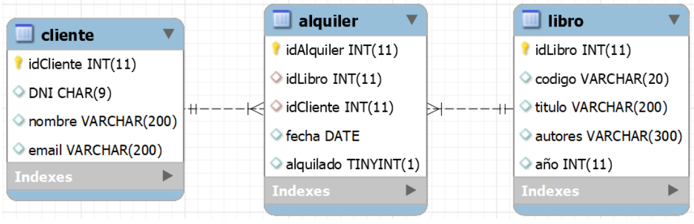

# Ejercicio 305 – Acceso a datos con Hibernate (AD)


**Unidad 3 – Administración de Datos (AD)**

**Enunciado**   
Ejercicio 305
Para este ejercicio usaremos la base de datos definida en el script bd-biblioteca.sql. El cual tiene el siguiente modelo relacional:




```SQL
 drop database if exists biblioteca;
create database biblioteca;

use biblioteca;

create table libro (
	idLibro int primary key AUTO_INCREMENT, 
    codigo varchar(20), 
    titulo varchar(200),
    autores varchar(300), 
    año int
);

create table cliente (
	idCliente int primary key AUTO_INCREMENT,
    DNI char(9),
    nombre varchar(200),
    email varchar(200)
);

create table alquiler (
	idAlquiler int primary key AUTO_INCREMENT,
    idLibro int, 
	idCliente int,
    fecha Date, 
    alquilado bool,
    foreign key (idLibro) references libro(idLibro),
    foreign key (idCliente) references cliente(idCliente)
);

insert into libro(codigo, titulo, autores, año)
values 	('asdfg', 'Pride and Prejudice', 'Jane Austen',1870),
		('asrwqeg', 'Persuation', 'Jane Austen',1875),
		('asdfdsa', 'El Quijote', 'Miguel de Cervantes',1700);
        
insert into cliente(DNI, nombre, email)
values 	('11111111A', 'Ana', 'ana@gmail.com'),
		('22222222B', 'Pablo', 'pablo@gmail.com');
        
insert into alquiler(idLibro, idCliente, fecha, alquilado) 
values 	(1,1,'2013-11-05', false),
		(2,1,'2018-02-05', false),
		(3,1,'2022-12-10', true),
		(2,2,'2022-11-05', true),
		(3,2,'2020-11-05', false);

```

Deberás crear un proyecto Hibernate que mapee las tablas de la base de datos. Las clases que interaccionan con la base de datos deberán estar en un paquete llamado `modelo`.

La aplicación debe tener, al menos, los siguientes métodos:

- `obtenerCliente(idCliente)`: devuelve el objeto del cliente solicitado.
- `añadirCliente(cliente)`: añade el cliente a la BD.
- `modificarCliente(cliente)`: modifica el cliente en la BD.
- `borrarCliente(cliente)`: borra un cliente en el caso de que no tenga ningún libro alquilado. Devuelve un booleano en función de si el cliente ha sido borrado o no.
- `esAlquilado(idLibro)`: devuelve un booleano en función de si el libro está alquilado.
- `alquilar(idLibro, idCliente)`: crea el alquiler de un libro. Se debe comprobar que el libro y el cliente existan y que el libro no esté ya alquilado.
- `devolver(idLibro)`: devuelve un libro si estaba alquilado.

En el programa principal debes probar que cada uno de los métodos funciona correctamente.


---

## Estructura del proyecto

```text
Ejercicio301/
├── .mvn/
├── src/
│   ├── main/
│   │   ├── java/
│   │   │   └── com.AD.U3/
│   │   │       ├── entities/
│   │   │       │   ├── Autor.java
│   │   │       │   └── Libro.java
│   │   │       │   └── Telefono.java
│   │   │       ├── repository/
│   │   │       │   ├── AutorRepositorio.java
│   │   │       │   ├── LibroRepositorio.java
│   │   │       │   └── TelefonoRepositorio.java
│   │   │       │   └── Repositorio.java
│   │   │       ├── App.java
│   │   │       └── HibernateUtil.java
│   │   └── resources/
│   │       └── hibernate.cfg.xml
│   └── test/
├── target/
│   ├── classes/
│   └── generated-sources/
├── Ejercicio305.md
└── pom.xml
```
### Solucion

**Entities/Autor.java**
```java 
package com.AD.U3.entities;


import jakarta.persistence.*;
import lombok.Data;
import lombok.NoArgsConstructor;
import lombok.RequiredArgsConstructor;
import lombok.NonNull;

import java.util.ArrayList;
import java.util.List;

@Data
@NoArgsConstructor
@RequiredArgsConstructor
@Entity
@Table(name = "Autores")
public class Autor {

    @Id
    @NonNull
    @Column(name = "DniAutor")
    private String dniAutor;

    @NonNull
    @Column(name = "Nombre")
    private String nombre;

    @NonNull
    @Column(name = "Nacionalidad")
    private String nacionalidad;

    @ManyToMany
    @JoinTable(name = "Libros_Autores",
            joinColumns = @JoinColumn(name = "DniAutor"),
            inverseJoinColumns = @JoinColumn(name = "idLibro"))
    private List<Libro> listaLibros = new ArrayList<>();

    @OneToOne(mappedBy = "autor", cascade = CascadeType.ALL)
    private Telefono telefono;

    public void addLibro(Libro libro) {
        if (this.listaLibros == null) {
            this.listaLibros = new ArrayList<>();
        }
        this.listaLibros.add(libro);
        // Además asegúrate de sincronizar el otro lado:
        if (libro.getListaAutores() == null) {
            libro.setListaAutores(new ArrayList<>());
        }
        libro.getListaAutores().add(this);
    }
}

```
**Entities/Libro.java**
```java 
package com.AD.U3.entities;


import jakarta.persistence.*;
import lombok.Data;
import lombok.NoArgsConstructor;
import lombok.RequiredArgsConstructor;
import lombok.NonNull;

import java.util.ArrayList;
import java.util.List;

@Data
@NoArgsConstructor
@RequiredArgsConstructor
@Entity
@Table(name = "Libros",
        uniqueConstraints = @UniqueConstraint(columnNames = "Titulo",
                name = "tituloUniqueConstraint"))
public class Libro {

    @Id
    @GeneratedValue(strategy = GenerationType.IDENTITY)
    @Column(name = "idLibro")
    private int id;

    @NonNull
    @Column(name = "Titulo")
    private String titulo;

    @NonNull
    @Column(name = "Precio")
    private double precio;

    @ManyToMany(mappedBy = "listaLibros")
    private List<Autor> listaAutores = new ArrayList<>();
}


```

**Entities/Telefono.java**
```java 
package com.AD.U3.entities;

import jakarta.persistence.*;
import lombok.Data;
import lombok.NoArgsConstructor;
import lombok.RequiredArgsConstructor;
import lombok.NonNull;

import java.io.Serializable;

@Data
@NoArgsConstructor
@RequiredArgsConstructor
@Entity
@Table(name = "Telefonos")
public class Telefono implements Serializable {

    @Id
    @Column(name = "dni_autor")
    private String dniAutor;

    @OneToOne
    @MapsId
    @JoinColumn(name = "dni_autor")
    private Autor autor;

    @NonNull
    @Column(name = "NumeroTf")
    private String numeroTf;
}


```

**Repository/Repositorio.java**
```java 
package com.AD.U3.repository;


import java.util.List;

public interface Repositorio<T> {

    void insertarUno(T t);
    void borrar(T t);
    List<T> encontrarTodos();
    T encontrarUnoPorString(String nombre);
    void actualizar(T t);
}


```
**Repository/AutorRepositorio.java**
```java 
package com.AD.U3.repository;


import com.AD.U3.entities.Autor;
import org.hibernate.Session;
import org.hibernate.Transaction;
import org.hibernate.query.Query;

import java.util.List;

public class AutorRepositorio implements Repositorio<Autor>{

    private Session sesion;

    public AutorRepositorio(Session sesion) {
        this.sesion = sesion;
    }

    @Override
    public void insertarUno(Autor t) {
        Transaction trx = sesion.beginTransaction();
        sesion.persist(t);
        trx.commit();
    }

    @Override
    public void borrar(Autor t) {
        Transaction trx = sesion.beginTransaction();
        sesion.remove(t);
        trx.commit();
    }

    @Override
    public List<Autor> encontrarTodos() {
        Query query = sesion.createQuery("SELECT a FROM Autor a");
        List<Autor> listaAutores = query.getResultList();

        return listaAutores;
    }

    @Override
    public Autor encontrarUnoPorString(String dni) {
        Query query = sesion.createQuery("SELECT a FROM Autor a WHERE a.dniAutor=:dni");

        query.setParameter("dni", dni);

        return (Autor) query.getSingleResult();
    }

    @Override
    public void actualizar(Autor t) {
        Transaction trx = sesion.beginTransaction();
        sesion.update(t);
        trx.commit();

    }

}


```
**Repository/LibroRepositorio.java**
```java 
package com.AD.U3.repository;


import com.AD.U3.entities.Libro;
import org.hibernate.Session;
import org.hibernate.Transaction;
import org.hibernate.query.Query;

import java.util.List;

public class LibroRepositorio implements Repositorio<Libro>{

    private Session sesion;

    public LibroRepositorio(Session sesion) {
        this.sesion = sesion;
    }

    @Override
    public void insertarUno(Libro t) {
        Transaction trx = sesion.beginTransaction();
        sesion.persist(t);
        trx.commit();

    }

    @Override
    public void borrar(Libro t) {
        Transaction trx = sesion.beginTransaction();
        sesion.remove(t);
        trx.commit();

    }

    @Override
    public List<Libro> encontrarTodos() {
        Query query = sesion.createQuery("SELECT l FROM Libro l");
        List<Libro> listaLibros = query.getResultList();

        return listaLibros;
    }

    @Override
    public Libro encontrarUnoPorString(String nombre) {
        Query query = sesion.createQuery("SELECT l FROM Libro l WHERE l.titulo=:nombre");

        query.setParameter("nombre", nombre);

        return (Libro) query.getSingleResult();
    }

    @Override
    public void actualizar(Libro t) {
        Transaction trx = sesion.beginTransaction();
        sesion.update(t);
        trx.commit();

    }

}

```
**Repository/TelefonoRepositorio.java**
```java 
package com.AD.U3.repository;


import com.AD.U3.entities.Telefono;
import org.hibernate.Session;
import org.hibernate.Transaction;

import java.util.List;

public class TelefonoRepositorio implements Repositorio<Telefono>{

    private Session sesion;

    public TelefonoRepositorio(Session sesion) {
        this.sesion = sesion;
    }

    @Override
    public void insertarUno(Telefono t) {
        Transaction trx = sesion.beginTransaction();
        sesion.persist(t);
        trx.commit();

    }

    @Override
    public void borrar(Telefono t) {
        Transaction trx = sesion.beginTransaction();
        sesion.remove(t);
        trx.commit();
    }

    @Override
    public List<Telefono> encontrarTodos() {
        // TODO Auto-generated method stub
        return null;
    }

    @Override
    public Telefono encontrarUnoPorString(String nombre) {
        // TODO Auto-generated method stub
        return null;
    }

    @Override
    public void actualizar(Telefono t) {
        Transaction trx = sesion.beginTransaction();
        sesion.update(t);
        trx.commit();
    }

}


```

**App.java**
```java 
package com.AD.U3;

import com.AD.U3.entities.Autor;
import com.AD.U3.entities.Libro;
import com.AD.U3.entities.Telefono;
import com.AD.U3.repository.AutorRepositorio;
import com.AD.U3.repository.LibroRepositorio;
import com.AD.U3.repository.TelefonoRepositorio;
import org.hibernate.Session;

import java.util.List;
import java.util.Scanner;

public class App {

    private static Scanner sc;
    private static AutorRepositorio aRepositorio;
    private static LibroRepositorio libroRepositorio;
    private static TelefonoRepositorio tRepositorio;

    public static void main(String[] args) {
        System.out.println("Ejercicio 304");

        sc = new Scanner(System.in);
        Session session = HibernateUtil.get().openSession();
        aRepositorio = new AutorRepositorio(session);
        libroRepositorio = new LibroRepositorio(session);
        tRepositorio = new TelefonoRepositorio(session);

        mostrarMenu();

        session.close();
        System.out.println("Finalizando la conexión a MySQL");
    }

    public static void mostrarMenu() {
        int opcion = -1;
        do {
            System.out.println();
            System.out.println("1. Insertar nueva fila");
            System.out.println("2. Borrar fila");
            System.out.println("3. Consultar");
            System.out.println("4. Salir");
            System.out.print("Elija opción: ");
            opcion = sc.nextInt();
            switch (opcion) {
                case 1:
                    mostrarMenuInsertar();
                    break;
                case 2:
                    mostrarMenuBorrar();
                    break;
                case 3:
                    mostrarMenuConsultas();
                    break;
                case 4:
                    System.exit(0);
                    break;
                default:
                    System.out.println("Opción inválida");
            }
        } while (opcion != 4);
    }

    public static void mostrarMenuInsertar() {
        int opcion = -1;
        do {
            System.out.println();
            System.out.println("1. Insertar nuevo autor");
            System.out.println("2. Insertar nuevo libro");
            System.out.println("3. Enlazar autor-libro");
            System.out.println("4. Insertar teléfono para un autor");
            System.out.println("5. Atrás");
            System.out.print("Elija opción: ");
            opcion = sc.nextInt();
            switch (opcion) {
                case 1:
                    insertarAutor();
                    break;
                case 2:
                    insertarLibro();
                    break;
                case 3:
                    enlazarAutorLibro();
                    break;
                case 4:
                    insertarTelefonoAutor();
                    break;
                case 5:
                    // volver
                    break;
                default:
                    System.out.println("Opción inválida");
            }
        } while (opcion < 1 || opcion > 5);
    }

    private static void insertarTelefonoAutor() {
        sc.nextLine(); // limpiar buffer
        String dni    = pedirString("Introduzca el DNI del autor:");
        String numTel = pedirString("Introduzca el número de teléfono:");

        Telefono telefono = new Telefono(numTel);
        Autor autor = aRepositorio.encontrarUnoPorString(dni);

        autor.setTelefono(telefono);
        aRepositorio.actualizar(autor);
        tRepositorio.insertarUno(telefono);
    }

    public static void insertarLibro() {
        sc.nextLine(); // limpiar buffer
        String titulo = pedirString("Introduzca el título del libro:");
        System.out.print("Introduzca el precio del libro: ");
        double precio = sc.nextDouble();

        Libro libro = new Libro(titulo, precio);
        libroRepositorio.insertarUno(libro);
    }

    public static void insertarAutor() {
        sc.nextLine(); // limpiar buffer
        String dni       = pedirString("Introduzca el DNI del autor:");
        String nombre    = pedirString("Introduzca el nombre del autor:");
        String localidad = pedirString("Introduzca la localidad del autor:");

        Autor autor = new Autor(dni, nombre, localidad);
        aRepositorio.insertarUno(autor);
    }

    public static void enlazarAutorLibro() {
        sc.nextLine(); // limpiar buffer
        String dni    = pedirString("Introduzca el DNI del autor:");
        String titulo = pedirString("Introduzca el título del libro:");

        Autor autor = aRepositorio.encontrarUnoPorString(dni);
        Libro libro = libroRepositorio.encontrarUnoPorString(titulo);

        autor.getListaLibros().add(libro);
        libro.getListaAutores().add(autor);

        aRepositorio.actualizar(autor);
        libroRepositorio.actualizar(libro);
    }

    public static void mostrarMenuBorrar() {
        int opcion = -1;
        do {
            System.out.println();
            System.out.println("1. Borrar autor");
            System.out.println("2. Borrar libro");
            System.out.println("3. Atrás");
            System.out.print("Elija opción: ");
            opcion = sc.nextInt();
            switch (opcion) {
                case 1:
                    sc.nextLine();
                    String dni = pedirString("Introduzca el DNI del autor:");
                    Autor autor = aRepositorio.encontrarUnoPorString(dni);
                    aRepositorio.borrar(autor);
                    break;
                case 2:
                    sc.nextLine();
                    String titulo = pedirString("Introduzca el título del libro:");
                    Libro libro = libroRepositorio.encontrarUnoPorString(titulo);
                    libroRepositorio.borrar(libro);
                    break;
                case 3:
                    // volver
                    break;
                default:
                    System.out.println("Opción inválida");
            }
        } while (opcion < 1 || opcion > 3);
    }

    public static void mostrarMenuConsultas() {
        int opcion = -1;
        do {
            System.out.println();
            System.out.println("1. Visualizar datos de un libro a partir del título");
            System.out.println("2. Visualizar libros de un determinado autor");
            System.out.println("3. Visualizar todos los libros");
            System.out.println("4. Visualizar todos los autores y sus libros");
            System.out.println("5. Atrás");
            System.out.print("Elija opción: ");
            opcion = sc.nextInt();
            switch (opcion) {
                case 1:
                    sc.nextLine();
                    String titulo = pedirString("Introduzca el título de un libro:");
                    Libro libro = libroRepositorio.encontrarUnoPorString(titulo);
                    System.out.println(libro);
                    break;
                case 2:
                    sc.nextLine();
                    String dni = pedirString("Introduzca el DNI del autor:");
                    Autor autor = aRepositorio.encontrarUnoPorString(dni);
                    for (Libro l : autor.getListaLibros()) {
                        System.out.println(l);
                    }
                    break;
                case 3:
                    List<Libro> listaLibros = libroRepositorio.encontrarTodos();
                    for (Libro l : listaLibros) {
                        System.out.println(l);
                    }
                    break;
                case 4:
                    List<Autor> listaAutores = aRepositorio.encontrarTodos();
                    for (Autor a : listaAutores) {
                        System.out.println(a);
                        System.out.println("Libros:");
                        for (Libro l : a.getListaLibros()) {
                            System.out.println(l);
                        }
                    }
                    break;
                case 5:
                    mostrarMenu();
                    break;
                default:
                    System.out.println("Opción inválida");
            }
        } while (opcion < 1 || opcion > 5);
    }

    public static String pedirString(String mensaje) {
        System.out.print(mensaje + " ");
        return sc.nextLine();
    }
}

```
**HibernateUtil.java**
```java 
package com.AD.U3;

import org.hibernate.SessionFactory;
import org.hibernate.cfg.Configuration;

import java.io.File;

public class HibernateUtil {

    private static final SessionFactory SESSION_FACTORY;

    static {
        try {
            // Hibernate buscará hibernate.cfg.xml en el classpath (src/main/resources)
            SESSION_FACTORY = new Configuration()
                    .configure()    // sin argumentos
                    .buildSessionFactory();
        }catch(Throwable ex) {
            System.err.println("Error al crear la configuración de hibernate" + ex.getMessage());
            throw new ExceptionInInitializerError();
        }
    }

    public static SessionFactory get() {
        return SESSION_FACTORY;
    }
}

```

**hibernate.cfg.xml**
```xml 
<?xml version="1.0" encoding="UTF-8"?>
<!DOCTYPE hibernate-configuration PUBLIC "-//Hibernate/Hibernate Configuration DTD 3.0//EN" "http://www.hibernate.org/dtd/hibernate-configuration-3.0.dtd">
<hibernate-configuration>
    <session-factory>
        <property name="connection.driver_class">com.mysql.cj.jdbc.Driver</property>
        <property name="connection.url">jdbc:mysql://localhost:3306/biblioteca?serverTimezone=UTC</property>
        <property name="connection.username">root</property>
        <property name="connection.password">abc123.</property>
        <property name="hbm2ddl.auto">validate</property>
        <property name="dialect">org.hibernate.dialect.MySQL8Dialect</property>
        <property name="hibernate.dialect.storage_engine">innodb</property>
        <property name="hibernate.show_sql">true</property>

        <!--  mapping de las clases-->
        <mapping class="com.AD.U3.entities.Alquiler"/>
        <mapping class="com.AD.U3.entities.Libro"/>
        <mapping class="com.AD.U3.entities.Cliente"/>
    </session-factory>
</hibernate-configuration>
```
