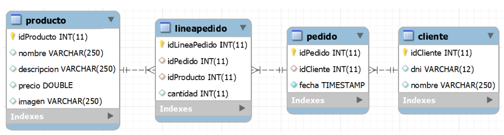

# Ejercicio 306 – Acceso a datos con Hibernate (AD)


**Unidad 3 – Administración de Datos (AD)**

**Enunciado**   
Ejercicio 306

Para este ejercicio usaremos la base de datos definida en el script bd-pedidos.sql. El cual tiene el siguiente modelo relacional:



```SQL
 drop database if exists pedidos;
create database pedidos;

use pedidos;

create table producto (
	idProducto int primary key AUTO_INCREMENT,
    nombre varchar(250),
    descripcion varchar(250),
    precio double,
    imagen varchar(250)
);

create table cliente (
	idCliente int primary key AUTO_INCREMENT,
    dni varchar(12),
    nombre varchar(250)
);

create table pedido (
	idPedido int primary key AUTO_INCREMENT,
    idCliente int, 
    fecha timestamp default current_timestamp,
    foreign key (idCliente) references cliente(idCliente)
);

create table lineaPedido (
	idLineaPedido int primary key AUTO_INCREMENT,
    idPedido int,
    idProducto int,
    cantidad int,
    foreign key (idProducto) references producto(idProducto),
    foreign key (idPedido) references pedido(idPedido)
);

insert into producto(nombre, descripcion, precio, imagen)
values 	('camiseta', 'Camiseta de manga corta.', 15.5, 'img/camiseta.jpg'),
		('pantalon', 'Pantalon vaquero', 30, 'img/pantalon.jpg'),
		('chaqueta', 'Chaqueta de cuero.',  47.75, 'img/chaqueta.jpg'),
		('zapatos', 'Zapatos negros', 100, 'img/zapatos.jpg');

insert into cliente(dni, nombre) 
values 	('11111111A','Daniel'),
		('22222222B','Lucia'),
		('33333333C','Beatriz');

insert into pedido(idCliente, fecha)
values 	(1,'2020-11-05 12:24:37'),
		(2,'2022-10-20 08:34:11');

insert into lineaPedido(idPedido, idProducto, cantidad)
values 	(1, 1, 3),
		(1, 2, 6),
		(2, 2, 10),
		(2, 3, 5),
		(2, 4, 5);


```

Deberás crear un proyecto Hibernate que mapee las tablas de la base de datos. Las clases que interaccionan con la base de datos deberán estar en un paquete llamado `modelo`.

La aplicación debe tener, al menos, los siguientes métodos:

- `obtenerCliente(idCliente)`: devuelve el objeto del cliente solicitado.
- `añadirCliente(cliente)`: añade el cliente a la BD.
- `modificarCliente(cliente)`: modifica el cliente en la BD.
- `borrarCliente(cliente)`: borra un cliente en el caso de que no tenga ningún libro alquilado. Devuelve un booleano en función de si el cliente ha sido borrado o no.
- `esAlquilado(idLibro)`: devuelve un booleano en función de si el libro está alquilado.
- `alquilar(idLibro, idCliente)`: crea el alquiler de un libro. Se debe comprobar que el libro y el cliente existan y que el libro no esté ya alquilado.
- `devolver(idLibro)`: devuelve un libro si estaba alquilado.

En el programa principal debes probar que cada uno de los métodos funciona correctamente.


---

## Estructura del proyecto

```text
Ejercicio301/
├── .mvn/
├── src/
│   ├── main/
│   │   ├── java/
│   │   │   └── com.AD.U3/
│   │   │       ├── entities/
│   │   │       │   ├── Cliente.java
│   │   │       │   └── LineaPedido.java
│   │   │       │   └── Pedido.java
│   │   │       │   └── Producto.java
│   │   │       ├── repository/
│   │   │       │   ├── ClienteRepositorio.java
│   │   │       │   ├── LineaPedidoRepositorio.java
│   │   │       │   └── PedidoRepositorio.java
│   │   │       │   └── ProductoRepositorio.java
│   │   │       ├── App.java
│   │   │       └── HibernateUtil.java
│   │   └── resources/
│   │       └── hibernate.cfg.xml
│   └── test/
├── target/
│   ├── classes/
│   └── generated-sources/
├── Ejercicio306.md
└── pom.xml
```
### Solucion

**Entities/Cliente.java**
```java 
package com.AD.U3.entities;


import jakarta.persistence.*;

import java.util.List;


@Entity
@Table(name = "cliente")
public class Cliente {

    @Id
    @GeneratedValue(strategy = GenerationType.IDENTITY)
    @Column(name = "idCliente")
    private int idCliente;
    private String dni;
    private String nombre;

    @OneToMany(mappedBy = "cliente", cascade = CascadeType.ALL)
    private List<Pedido> listaPedidos;

    public Cliente() {
        super();
    }

    public Cliente(int idCliente) {
        super();
        this.idCliente = idCliente;
    }

    public Cliente(int idCliente, String dni, String nombre, List<Pedido> listaPedidos) {
        super();
        this.idCliente = idCliente;
        this.dni = dni;
        this.nombre = nombre;
        this.listaPedidos = listaPedidos;
    }

    public int getIdCliente() {
        return idCliente;
    }

    public void setIdCliente(int idCliente) {
        this.idCliente = idCliente;
    }

    public String getDni() {
        return dni;
    }

    public void setDni(String dni) {
        this.dni = dni;
    }

    public String getNombre() {
        return nombre;
    }

    public void setNombre(String nombre) {
        this.nombre = nombre;
    }

    public List<Pedido> getListaPedidos() {
        return listaPedidos;
    }

    public void setListaPedidos(List<Pedido> listaPedidos) {
        this.listaPedidos = listaPedidos;
    }
}


```
**Entities/LineaPedido.java**
```java 
package com.AD.U3.entities;


import jakarta.persistence.*;

@Entity
@Table(name = "lineaPedido")
public class LineaPedido {

    @Id
    @GeneratedValue(strategy = GenerationType.IDENTITY)
    @Column(name = "idLineaPedido")
    private int idLineaPedido;
    private int cantidad;

    @ManyToOne
    @JoinColumn(name = "idProducto")
    private Producto producto;

    @ManyToOne(cascade = CascadeType.ALL)
    @JoinColumn(name = "idPedido")
    private Pedido pedido;

    public LineaPedido() {
        super();
    }

    public LineaPedido(int cantidad, Producto producto, Pedido pedido) {
        super();
        this.cantidad = cantidad;
        this.producto = producto;
        this.pedido = pedido;
    }

    public int getIdLineaPedido() {
        return idLineaPedido;
    }

    public void setIdLineaPedido(int idLineaPedido) {
        this.idLineaPedido = idLineaPedido;
    }

    public int getCantidad() {
        return cantidad;
    }

    public void setCantidad(int cantidad) {
        this.cantidad = cantidad;
    }

    public Producto getProducto() {
        return producto;
    }

    public void setProducto(Producto producto) {
        this.producto = producto;
    }

    public Pedido getPedido() {
        return pedido;
    }

    public void setPedido(Pedido pedido) {
        this.pedido = pedido;
    }

    @Override
    public String toString() {
        return "LineaPedido [idLineaPedido=" + idLineaPedido + ", cantidad=" + cantidad + ", producto=" + producto.getNombre()
                + ", pedido=" + pedido.getIdPedido() + "]";
    }

}


```

**Entities/Pedido.java**
```java 
package com.AD.U3.entities;


import jakarta.persistence.*;

import java.util.Date;
import java.util.List;


@Entity
@Table(name = "pedido")
public class Pedido {

    @Id
    @GeneratedValue(strategy = GenerationType.IDENTITY)
    @Column(name = "idPedido")
    private int idPedido;

    private Date fecha;

    @ManyToOne(cascade = CascadeType.ALL, fetch = FetchType.EAGER)
    @JoinColumn(name = "idCliente")
    private Cliente cliente;

    @OneToMany(mappedBy = "pedido", cascade = CascadeType.ALL)
    private List<LineaPedido> listaPedidos;

    public Pedido() {
        super();
    }

    public Pedido(Date fecha, Cliente cliente) {
        super();
        this.fecha = fecha;
        this.cliente = cliente;
    }

    public int getIdPedido() {
        return idPedido;
    }

    public void setIdPedido(int idPedido) {
        this.idPedido = idPedido;
    }

    public Date getFecha() {
        return fecha;
    }

    public void setFecha(Date fecha) {
        this.fecha = fecha;
    }

    public Cliente getCliente() {
        return cliente;
    }

    public void setCliente(Cliente cliente) {
        this.cliente = cliente;
    }

    public List<LineaPedido> getListaPedidos() {
        return listaPedidos;
    }

    public void setListaPedidos(List<LineaPedido> listaPedidos) {
        this.listaPedidos = listaPedidos;
    }

    @Override
    public String toString() {
        return "Pedido [idPedido=" + idPedido + ", fecha=" + fecha + ", cliente=" + cliente + ", listaPedidos="
                + listaPedidos + "]";
    }

}


```

**Entities/Producto.java**
```java 
package com.AD.U3.entities;


import jakarta.persistence.*;

import java.util.List;


@Entity
@Table(name = "producto")
public class Producto {

    @Id
    @GeneratedValue(strategy = GenerationType.IDENTITY)
    @Column(name = "idProducto")
    private int idProducto;

    private String nombre;
    private String descripcion;
    private double precio;
    private String imagen;

    @OneToMany(mappedBy = "producto",  cascade = CascadeType.ALL)
    private List<LineaPedido> listaPedidos;

    public Producto() {
        super();
    }

    public Producto(int idProducto, String nombre, String descripcion, double precio, String imagen,
                    List<LineaPedido> listaPedidos) {
        super();
        this.idProducto = idProducto;
        this.nombre = nombre;
        this.descripcion = descripcion;
        this.precio = precio;
        this.imagen = imagen;
        this.listaPedidos = listaPedidos;
    }

    public Producto(int idProducto) {
        super();
        this.idProducto = idProducto;
    }

    public int getIdProducto() {
        return idProducto;
    }

    public void setIdProducto(int idProducto) {
        this.idProducto = idProducto;
    }

    public String getNombre() {
        return nombre;
    }

    public void setNombre(String nombre) {
        this.nombre = nombre;
    }

    public String getDescripcion() {
        return descripcion;
    }

    public void setDescripcion(String descripcion) {
        this.descripcion = descripcion;
    }

    public double getPrecio() {
        return precio;
    }

    public void setPrecio(double precio) {
        this.precio = precio;
    }

    public String getImagen() {
        return imagen;
    }

    public void setImagen(String imagen) {
        this.imagen = imagen;
    }

    public List<LineaPedido> getListaPedidos() {
        return listaPedidos;
    }

    public void setListaPedidos(List<LineaPedido> listaPedidos) {
        this.listaPedidos = listaPedidos;
    }

    @Override
    public String toString() {
        return "Producto [idProducto=" + idProducto + ", nombre=" + nombre + ", descripcion=" + descripcion
                + ", precio=" + precio + ", imagen=" + imagen + ", listaPedidos=" + listaPedidos + "]";
    }

}


```

**Repository/ClienteRepositorio.java**
```java 
package com.AD.U3.repository;


import com.AD.U3.entities.Cliente;
import org.hibernate.Session;
import org.hibernate.Transaction;
import org.hibernate.query.Query;


public class ClienteRepositorio {
    Session sesion;

    public ClienteRepositorio() {    }

    public ClienteRepositorio(Session sesion) {
        this.sesion = sesion;
    }

    public Cliente obtenerClientePorDNI(String dni) {
        Transaction trx = this.sesion.beginTransaction();
        Cliente cliente;
        try {

            Query query = this.sesion.createQuery("select c from Cliente c where c.dni=:dni");
            query.setParameter("dni", dni);
            cliente = (Cliente) query.getSingleResult();

        }catch (Exception e) {
            cliente = new Cliente(-1);
        }

        trx.commit();

        return cliente;
    }

}


```
**Repository/LineaPedidoRepositorio.java**
```java 
package com.AD.U3.repository;


import com.AD.U3.entities.Cliente;
import com.AD.U3.entities.LineaPedido;
import org.hibernate.Session;
import org.hibernate.Transaction;
import org.hibernate.query.Query;

import java.util.ArrayList;


public class LineaPedidoRepositorio {
    Session sesion;

    public LineaPedidoRepositorio() {    }

    public LineaPedidoRepositorio(Session sesion) {
        this.sesion = sesion;
    }

    public void mostrarTodosPedidos() {
        Transaction trx = this.sesion.beginTransaction();

        Query query = this.sesion.createQuery("select lp from LineaPedido lp");
        ArrayList<LineaPedido> listaPedidos = (ArrayList<LineaPedido>) query.getResultList();

        for(LineaPedido lPedido : listaPedidos)
            System.out.println(lPedido.toString());

        trx.commit();
    }

    public void mostrarPedidosCliente(Cliente cliente) {
        Transaction trx = this.sesion.beginTransaction();

        Query query = this.sesion.createQuery("select lp from LineaPedido lp where lp.pedido.cliente.idCliente=:idCliente");

        query.setParameter("idCliente", cliente.getIdCliente());

        ArrayList<LineaPedido> listaPedidos = (ArrayList<LineaPedido>) query.getResultList();

        for(LineaPedido lPedido : listaPedidos)
            System.out.println(lPedido.toString());

        trx.commit();
    }

}


```
**Repository/PedidoRepositorio.java**
```java 
package com.AD.U3.repository;


import com.AD.U3.entities.Cliente;
import com.AD.U3.entities.LineaPedido;
import com.AD.U3.entities.Pedido;
import com.AD.U3.entities.Producto;
import org.hibernate.Session;
import org.hibernate.Transaction;
import org.hibernate.query.Query;

import java.util.ArrayList;
import java.util.Date;
import java.util.Scanner;


public class PedidoRepositorio {
    Session sesion;
    Scanner scanner;
    ProductoRepositorio productoRepositorio;

    public PedidoRepositorio() {    }

    public PedidoRepositorio(Session sesion, Scanner sc) {
        this.sesion = sesion;
        this.scanner = sc;
        this.productoRepositorio = new ProductoRepositorio(sesion);
    }

    public void eliminarPedido(int idPedido) {
        Transaction trx = this.sesion.beginTransaction();

        try {

            Query query = this.sesion.createQuery("select p from Pedido p where p.idPedido=:idPedido");
            query.setParameter("idPedido", idPedido);
            Pedido pedido = (Pedido) query.getSingleResult();

            this.sesion.remove(pedido);

        } catch (Exception e) {
            System.out.println("No existe el pedido con ese ID");
        }

        trx.commit();
    }

    public void addPedido(Cliente cliente) {
        ArrayList<LineaPedido> lineaPedidos = new ArrayList<LineaPedido>();

        Pedido pedido = new Pedido(new Date(), cliente);

        String opcion = "";
        do {
            int idProducto = pintarPedirInt("Introduce el id del producto");
            Producto producto = productoRepositorio.getProducto(idProducto);
            if(producto.getIdProducto() != -1) {
                LineaPedido lPedido = new LineaPedido(idProducto, producto, pedido);
                int cantidad = pintarPedirInt("Introduzca la cantidad de productos");
                lPedido.setCantidad(cantidad);
                lineaPedidos.add(lPedido);
            }
            opcion = pintarPedirString("Quieres seguir introduciendo productos al pedido? (y/n)");
        }while(!opcion.toLowerCase().equals("n"));

        pedido.setListaPedidos(lineaPedidos);

        this.sesion.persist(pedido);

        Transaction trxTransaction = this.sesion.beginTransaction();

        this.sesion.persist(pedido);

        trxTransaction.commit();

    }

    public int pintarPedirInt(String mensaje) {
        System.out.println(mensaje);
        return this.scanner.nextInt();
    }

    public String pintarPedirString(String mensaje) {
        System.out.println(mensaje);
        return this.scanner.next();
    }

}


```
**Repository/ProductoRepositorio.java**
```java 
package com.AD.U3.repository;


import com.AD.U3.entities.Producto;
import org.hibernate.Session;
import org.hibernate.query.Query;


public class ProductoRepositorio {
    Session sesion;

    public ProductoRepositorio() {    }

    public ProductoRepositorio(Session sesion) {
        this.sesion = sesion;
    }

    public Producto getProducto(int idProducto) {
        try {
            Query query = this.sesion.createQuery("select p from Producto p where p.idProducto=:idProducto");
            query.setParameter("idProducto", idProducto);

            Producto producto = (Producto) query.getSingleResult();

            return producto;
        } catch (Exception e) {
            return new Producto(-1);
        }
    }

}


```

**App.java**
```java 
package com.AD.U3;
/*
Ejercicio 306
Para este ejercicio usaremos la base de datos definida en el script bd-pedidos.sql. El cual tiene el siguiente modelo relacional:


Deberás crear un proyecto Hibernate que mapee las tablas de la base de datos. La aplicación debe permitir hacer lo siguiente:

Mostrar todos los pedidos de la base de datos.
Mostrar todos los pedidos de un cliente.
Añadir un pedido y sus productos.
Borrar un pedido con sus productos.
 */
import com.AD.U3.entities.Cliente;
import com.AD.U3.repository.ClienteRepositorio;
import com.AD.U3.repository.LineaPedidoRepositorio;
import com.AD.U3.repository.PedidoRepositorio;
import org.hibernate.Session;

import java.util.Scanner;

/**
 * Hello world!
 *
 */
public class App {

    static Scanner scanner = new Scanner(System.in);
    public static void main(String[] args) {

        System.out.println("Test");

        Session session = HibernateUtil.get().openSession();

        LineaPedidoRepositorio lineaPedidoRepositorio = new LineaPedidoRepositorio(session);
        ClienteRepositorio clienteRepositorio = new ClienteRepositorio(session);
        PedidoRepositorio pedidoRepositorio = new PedidoRepositorio(session, scanner);

        int opcion = -1;

        do {
            opcion = pintarPedirInt("1. Mostrar todos los pedidos\n2. Mostrar pedidos de un cliente\n"
                    + "3. Añadir pedido\n4. Borrar pedido\n5. Salir");

            switch (opcion) {
                case 1: {

                    lineaPedidoRepositorio.mostrarTodosPedidos();
                    break;
                }
                case 2: {
                    String dniCliente = pintarPedirString("Introduzca el DNI del cliente");
                    Cliente cliente = clienteRepositorio.obtenerClientePorDNI(dniCliente);
                    lineaPedidoRepositorio.mostrarPedidosCliente(cliente);
                    break;
                }
                case 3: {
                    String dniCliente = pintarPedirString("Introduzca el DNI del cliente");
                    Cliente cliente = clienteRepositorio.obtenerClientePorDNI(dniCliente);
                    if (cliente.getIdCliente() != -1)
                        pedidoRepositorio.addPedido(cliente);
                    else
                        System.out.println("No existe un cliente con ese ID");
                    break;
                }
                case 4: {
                    int idPedido = pintarPedirInt("Introduzca el id del pedido");
                    pedidoRepositorio.eliminarPedido(idPedido);
                    break;
                }
                case 5: {
                    System.exit(0);
                    break;
                }
            }

        } while (opcion != 5);

        session.close();
        System.out.println("Finalizando la conexion a MySQL");
    }

    public static int pintarPedirInt(String mensaje) {
        System.out.println(mensaje);
        return scanner.nextInt();
    }

    public static String pintarPedirString(String mensaje) {
        System.out.println(mensaje);
        return scanner.next();
    }

}


```
**HibernateUtil.java**
```java 
package com.AD.U3;

import org.hibernate.SessionFactory;
import org.hibernate.cfg.Configuration;

import java.io.File;

public class HibernateUtil {

    private static final SessionFactory SESSION_FACTORY;

    static {
        try {
            // Hibernate buscará hibernate.cfg.xml en el classpath (src/main/resources)
            SESSION_FACTORY = new Configuration()
                    .configure()    // sin argumentos
                    .buildSessionFactory();
        }catch(Throwable ex) {
            System.err.println("Error al crear la configuración de hibernate" + ex.getMessage());
            throw new ExceptionInInitializerError();
        }
    }

    public static SessionFactory get() {
        return SESSION_FACTORY;
    }
}

```

**hibernate.cfg.xml**
```xml 
<?xml version="1.0" encoding="UTF-8"?>
<!DOCTYPE hibernate-configuration PUBLIC "-//Hibernate/Hibernate Configuration DTD 3.0//EN" "http://www.hibernate.org/dtd/hibernate-configuration-3.0.dtd">
<hibernate-configuration>
    <session-factory>
        <property name="connection.driver_class">com.mysql.jdbc.Driver</property>
        <property name="connection.url">jdbc:mysql://localhost:3306/pedidos?serverTimezone=UTC</property>
        <property name="connection.username">root</property>
        <property name="connection.password">abc123.</property>
        <property name="hbm2ddl.auto">validate</property>
        <property name="dialect">org.hibernate.dialect.MySQL8Dialect</property>
        <property name="hibernate.dialect.storage_engine">innodb</property>
        <property name="hibernate.show_sql">true</property>
        <!-- Mapping de las clases-->
        <mapping class="com.AD.U3.entities.Cliente"/>
        <mapping class="com.AD.U3.entities.LineaPedido"/>
        <mapping class="com.AD.U3.entities.Pedido"/>
        <mapping class="com.AD.U3.entities.Producto"/>

    </session-factory>
</hibernate-configuration>
```
