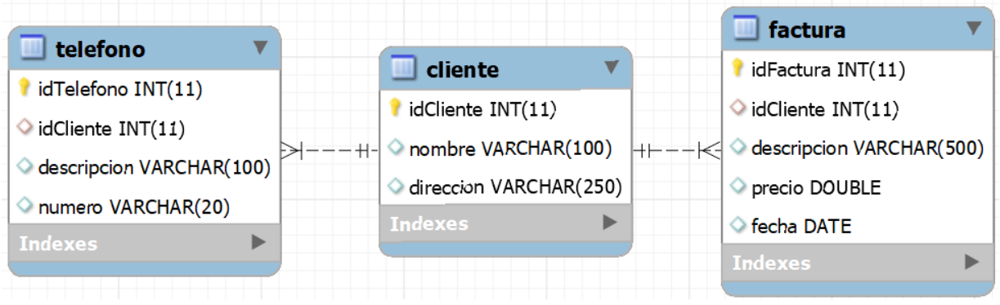

# Ejercicio 307 – Acceso a datos con Hibernate (AD)


**Unidad 3 – Administración de Datos (AD)**

**Enunciado**   
Ejercicio 307

Para este ejercicio usaremos la base de datos definida en el script bd-facturas.sql. El cual tiene el siguiente modelo relacional:




```SQL
drop database if exists facturacion;
create database facturacion;

use facturacion;

create table cliente(
	idCliente integer primary key AUTO_INCREMENT,
    nombre varchar(100),
    direccion varchar(250)
);

create table telefono(
	idTelefono integer primary key AUTO_INCREMENT,
    idCliente integer,
    descripcion varchar(100),
    numero varchar(20),
    foreign key (idCliente) references cliente(idCliente)
);

create table factura(
	idFactura integer primary key AUTO_INCREMENT,
    idCliente integer,
    descripcion varchar(500),
    precio double,
    fecha Date,
    foreign key (idCliente) references cliente(idCliente)
);


insert into cliente values (1, 'Leire', 'Rua Nova, 3');
insert into cliente values (2, 'Tomas', 'Rua Nova, 8');
insert into cliente values (3, 'Antonio', 'Preguntoiro, 1');

insert into telefono values (1, 1, 'fixo', '98111111');
insert into telefono values (2, 1, 'movil', '695111111');
insert into telefono values (3, 1, 'outro', '111111111');
insert into telefono values (4, 2, 'movil', '222222222');
insert into telefono values (5, 2, 'fixo', '981333333');
insert into telefono values (6, 3, 'movil', '695333333');

insert into factura values (1, 1, 'Software', 1000, '2021-11-05');
insert into factura values (2, 1, 'Curso', 2000,'2021-12-06');
insert into factura values (3, 2, 'Certificado', 200, '2021-12-15');
insert into factura values (4, 2, 'Material', 4000, '2022-01-05');
insert into factura values (5, 3, 'Curso', 2000, '2022-01-10');


```
Deberás crear un proyecto Hibernate que mapee las tablas de la base de datos. La aplicación debe permitir hacer lo siguiente:

- Mostrar todas las facturas de la base de datos. La información debe mostrarse de la siguiente forma:
  - ID: xxx
  - CLIENTE: nombre, dirección, telefonos (movil: xxx, otro: xxx, etc).
  - DESCRIPCION: xxx
  - PRECIO: xxx
- Añadir una factura.
- Modificar una factura.
- Borrar una factura.


---

## Estructura del proyecto

```text
Ejercicio301/
├── .mvn/
├── src/
│   ├── main/
│   │   ├── java/
│   │   │   └── com.AD.U3/
│   │   │       ├── entities/
│   │   │       │   ├── Cliente.java
│   │   │       │   └── Factura.java
│   │   │       │   └── Telefono.java
│   │   │       ├── repository/
│   │   │       │   ├── ClienteRepositorio.java
│   │   │       │   ├── FacturaRepositorio.java
│   │   │       ├── App.java
│   │   │       └── HibernateUtil.java
│   │   └── resources/
│   │       └── hibernate.cfg.xml
│   └── test/
├── target/
│   ├── classes/
│   └── generated-sources/
├── Ejercicio307.md
└── pom.xml
```
### Solucion

**Entities/Cliente.java**
```java 
package com.AD.U3.entities;


import jakarta.persistence.*;

import java.util.List;


@Entity
@Table(name = "cliente")
public class Cliente {

  @Id
  @GeneratedValue(strategy = GenerationType.IDENTITY)
  @Column(name = "idCliente")
  private int idCliente;
  private String nombre;
  private String direccion;

  @OneToMany(mappedBy = "idTelefono", cascade = CascadeType.ALL)
  private List<Telefono> listaTelefonos;

  @OneToMany(mappedBy = "idFactura", cascade = CascadeType.ALL)
  private List<Factura> listaFacturas;

  public Cliente() {
    super();
  }

  public Cliente(String nombre, String direccion) {
    super();
    this.nombre = nombre;
    this.direccion = direccion;
  }

  public int getIdCliente() {
    return idCliente;
  }

  public void setIdCliente(int idCliente) {
    this.idCliente = idCliente;
  }

  public String getNombre() {
    return nombre;
  }

  public void setNombre(String nombre) {
    this.nombre = nombre;
  }

  public String getDireccion() {
    return direccion;
  }

  public void setDireccion(String direccion) {
    this.direccion = direccion;
  }

  public void addFactura(Factura factura) {
    this.listaFacturas.add(factura);
  }

  @Override
  public String toString() {
    StringBuilder sBuilder = new StringBuilder();
    for(Telefono tlTelefono : listaTelefonos)
      sBuilder.append(tlTelefono.getDescripcion() + ": " + tlTelefono.getNumero() + " ");

    return nombre + ", " + direccion + ", telefonos (" + sBuilder.toString() + ")";
  }
}


```
**Entities/Factura.java**
```java 
package com.AD.U3.entities;


import jakarta.persistence.*;

import java.util.Date;


@Entity
@Table(name = "factura")
public class Factura {

  @Id
  @GeneratedValue(strategy = GenerationType.IDENTITY)
  @Column(name = "idFactura")
  private int idFactura;
  private String descripcion;
  private double precio;
  @Column(name = "fecha")
  @Temporal(TemporalType.DATE) // Se ajusta a DATE en la BD, cuando date da error se soluciona de esta manera
  private Date fecha;


  @ManyToOne
  @JoinColumn(name = "idCliente", referencedColumnName = "idCliente")
  private Cliente cliente;

  public Factura() {
    super();
  }

  public Factura(String descripcion, double precio, Date fechaDate) {
    super();
    this.descripcion = descripcion;
    this.precio = precio;
    this.fecha = fechaDate;
  }

  public int getIdFactura() {
    return idFactura;
  }

  public void setIdFactura(int idFactura) {
    this.idFactura = idFactura;
  }

  public String getDescripcion() {
    return descripcion;
  }

  public void setDescripcion(String descripcion) {
    this.descripcion = descripcion;
  }

  public double getPrecio() {
    return precio;
  }

  public void setPrecio(double precio) {
    this.precio = precio;
  }

  public Date getFechaDate() {
    return fecha;
  }

  public void setFechaDate(Date fechaDate) {
    this.fecha = fechaDate;
  }

  public Cliente getCliente() {
    return cliente;
  }

  public void setCliente(Cliente cliente) {
    this.cliente = cliente;
    cliente.addFactura(this);
  }

  @Override
  public String toString() {
    return "ID: " + idFactura +"\nCLIENTE: " + cliente +
            "\nDESCRIPCION: " + descripcion + "\nPRECIO:" + precio;
  }
}


```

**Entities/Telefono.java**
```java 
package com.AD.U3.entities;


import jakarta.persistence.*;

@Entity
@Table(name = "telefono")
public class Telefono {

  @Id
  @GeneratedValue(strategy = GenerationType.IDENTITY)
  @Column(name="idTelefono")
  private int idTelefono;
  private String descripcion;
  private String numero;

  @ManyToOne
  @JoinColumn(name = "idCliente", referencedColumnName = "idCliente")
  private Cliente cliente;

  public Telefono() {}

  public Telefono(String descripcion, String numero) {
    super();
    this.descripcion = descripcion;
    this.numero = numero;
  }

  public int getIdTelefono() {
    return idTelefono;
  }

  public void setIdTelefono(int idTelefono) {
    this.idTelefono = idTelefono;
  }

  public String getDescripcion() {
    return descripcion;
  }

  public void setDescripcion(String descripcion) {
    this.descripcion = descripcion;
  }

  public String getNumero() {
    return numero;
  }

  public void setNumero(String numero) {
    this.numero = numero;
  }

  public Cliente getCliente() {
    return cliente;
  }

  public void setCliente(Cliente cliente) {
    this.cliente = cliente;
  }
}


```

**Repository/ClienteRepositorio.java**
```java 
package com.AD.U3.repository;


import com.AD.U3.entities.Cliente;
import org.hibernate.Session;
import org.hibernate.Transaction;
import org.hibernate.query.Query;


public class ClienteRepositorio {
    Session sesion;

    public ClienteRepositorio() {    }

    public ClienteRepositorio(Session sesion) {
        this.sesion = sesion;
    }

    public Cliente obtenerClientePorDNI(String dni) {
        Transaction trx = this.sesion.beginTransaction();
        Cliente cliente;
        try {

            Query query = this.sesion.createQuery("select c from Cliente c where c.dni=:dni");
            query.setParameter("dni", dni);
            cliente = (Cliente) query.getSingleResult();

        }catch (Exception e) {
            cliente = new Cliente(-1);
        }

        trx.commit();

        return cliente;
    }

}


```
**Repository/ClienteRepositorio.java**
```java 
package com.AD.U3.repository;


import com.AD.U3.entities.Cliente;
import org.hibernate.Session;
import org.hibernate.Transaction;
import org.hibernate.query.Query;


public class ClienteRepositorio {

  Session session;

  public ClienteRepositorio(Session session) {
    this.session = session;
  }

  public Cliente getClientePorId(int idCliente) {
    Transaction trxTransaction = this.session.beginTransaction();

    Query query = this.session.createQuery("select c from Cliente c where c.idCliente=:idCliente");
    query.setParameter("idCliente", idCliente);
    Cliente cliente = (Cliente) query.getSingleResult();

    trxTransaction.commit();

    return cliente;
  }
}


```
**Repository/FacturaRepositorio.java**
```java 
package com.AD.U3.repository;


import com.AD.U3.entities.Cliente;
import com.AD.U3.entities.Factura;
import org.hibernate.Session;
import org.hibernate.Transaction;
import org.hibernate.query.Query;

import java.util.ArrayList;
import java.util.Date;
import java.util.Scanner;


public class FacturaRepositorio {

  Session session;
  Scanner scanner;

  public FacturaRepositorio(Session session, Scanner sc) {
    this.session = session;
    this.scanner = sc;
  }

  public void mostrarTodasFacturas() {
    Query query = this.session.createQuery("select f from Factura f");
    ArrayList<Factura> listaFacturas = (ArrayList<Factura>) query.getResultList();

    for(Factura f: listaFacturas)
      System.out.println(f.toString());
  }

  public void addFactura(Cliente cliente) {
    String descripcion = pedirString("Introduce la descripción de la factura");
    Double precio = pedirDouble("Introduce el precio de la factura");
    Factura factura = new Factura(descripcion, precio, new Date());
    factura.setCliente(cliente);
    this.session.persist(factura);
  }

  public void modificarFactura() {

    int idFactura = pedirInt("Introduzca el ID de la factura a modificar");
    String descripcion = pedirString("Introduzca la nueva descripción. Déjelo en blanco si quiere conservar la anterior");
    double precio = pedirDouble("Introduzca la nueva descripción. -1 para mantener la anterior");

    Transaction trxTransaction = this.session.beginTransaction();
    Factura factura = getFacturaId(idFactura);
    if(!descripcion.isEmpty())
      factura.setDescripcion(descripcion);

    if (precio != -1)
      factura.setPrecio(precio);

    this.session.persist(factura);

    trxTransaction.commit();

  }

  private Factura getFacturaId(int idFactura) {
    Query query = this.session.createQuery("select f from Factura f where f.idFactura=:idFactura");
    query.setParameter("idFactura", idFactura);

    Factura factura = (Factura) query.getSingleResult();

    return factura;
  }

  public void borrarFactura() {
    int idFactura = pedirInt("Introduce el ID de la factura");

    Transaction trxTransaction = this.session.beginTransaction();

    Query query = this.session.createQuery("select f from Factura f where f.idFactura=:idFactura");
    query.setParameter("idFactura", idFactura);
    Factura factura = (Factura) query.getSingleResult();

    this.session.remove(factura);

    trxTransaction.commit();
  }

  private int pedirInt(String string) {
    System.out.println(string);
    return this.scanner.nextInt();
  }

  private Double pedirDouble(String string) {
    System.out.println(string);
    return this.scanner.nextDouble();
  }

  private String pedirString(String string) {
    System.out.println(string);
    return this.scanner.next();
  }

}

```


**App.java**
```java 
package com.AD.U3;
/*
Ejercicio 307
Para este ejercicio usaremos la base de datos definida en el script bd-facturas.sql. El cual tiene el siguiente modelo relacional:


Deberás crear un proyecto Hibernate que mapee las tablas de la base de datos. La aplicación debe permitir hacer lo siguiente:

Mostrar todas las facturas de la base de datos. La información debe mostrarse de la siguiente forma:
ID: xxx
CLIENTE: nombre, dirección, telefonos (movil: xxx, otro: xxx, etc).
DESCRIPCION: xxx
PRECIO: xxx
Añadir una factura.
Modificar una factura.
Borrar una factura.
 */
import com.AD.U3.entities.Cliente;
import com.AD.U3.repository.ClienteRepositorio;
import com.AD.U3.repository.FacturaRepositorio;
import org.hibernate.Session;

import java.util.Scanner;

/**
 * Hello world!
 *
 */
public class App {

  static Scanner scanner ;

  public static void main(String[] args) {
    System.out.println("Ejercicio 307");

    Session session = HibernateUtil.get().openSession();

    scanner = new Scanner(System.in);

    FacturaRepositorio facturaRepositorio = new FacturaRepositorio(session, scanner);
    ClienteRepositorio clienteRepositorio = new ClienteRepositorio(session);

    int opcion = -1;

    do {
      opcion = pedirInt("1. Mostrar todas las facturas\n2. Añadir factura\n"
              + "3. Modificar factura\n4. Borrar factura\n5. Salir");

      switch (opcion) {
        case 1: {
          facturaRepositorio.mostrarTodasFacturas();
          break;
        }
        case 2: {
          int idCliente = pedirInt("Introduzca el ID del cliente");
          Cliente cliente = clienteRepositorio.getClientePorId(idCliente);
          facturaRepositorio.addFactura(cliente);
          break;
        }
        case 3: {
          facturaRepositorio.modificarFactura();
          break;
        }
        case 4: {
          facturaRepositorio.borrarFactura();
          break;
        }
        case 5: {
          System.exit(0);
          break;
        }
      }

    }while(opcion != 5);

    session.close();
    System.out.println("Finalizando la conexion a MySQL");
  }


  private static int pedirInt(String string) {
    System.out.println(string);
    return scanner.nextInt();
  }

  private Double pedirDouble(String string) {
    System.out.println(string);
    return scanner.nextDouble();
  }

  private String pedirString(String string) {
    System.out.println(string);
    return scanner.next();
  }

}

```
**HibernateUtil.java**
```java 
package com.AD.U3;

import org.hibernate.SessionFactory;
import org.hibernate.cfg.Configuration;

import java.io.File;

public class HibernateUtil {

    private static final SessionFactory SESSION_FACTORY;

    static {
        try {
            // Hibernate buscará hibernate.cfg.xml en el classpath (src/main/resources)
            SESSION_FACTORY = new Configuration()
                    .configure()    // sin argumentos
                    .buildSessionFactory();
        }catch(Throwable ex) {
            System.err.println("Error al crear la configuración de hibernate" + ex.getMessage());
            throw new ExceptionInInitializerError();
        }
    }

    public static SessionFactory get() {
        return SESSION_FACTORY;
    }
}

```

**hibernate.cfg.xml**
```xml 
<?xml version="1.0" encoding="UTF-8"?>
<!DOCTYPE hibernate-configuration PUBLIC "-//Hibernate/Hibernate Configuration DTD 3.0//EN" "http://www.hibernate.org/dtd/hibernate-configuration-3.0.dtd">
<hibernate-configuration>
  <session-factory>
    <property name="connection.driver_class">com.mysql.jdbc.Driver</property>
    <property name="connection.url">jdbc:mysql://localhost:3306/facturacion?serverTimezone=UTC</property>
    <property name="connection.username">root</property>
    <property name="connection.password">abc123.</property>
    <property name="hbm2ddl.auto">validate</property>
    <property name="dialect">org.hibernate.dialect.MySQL8Dialect</property>
    <property name="hibernate.dialect.storage_engine">innodb</property>
    <property name="hibernate.show_sql">true</property>

    <!--Mapping de las clases-->
    <mapping class="com.AD.U3.entities.Cliente"/>
    <mapping class="com.AD.U3.entities.Factura"/>
    <mapping class="com.AD.U3.entities.Telefono"/>

  </session-factory>
</hibernate-configuration>
```
