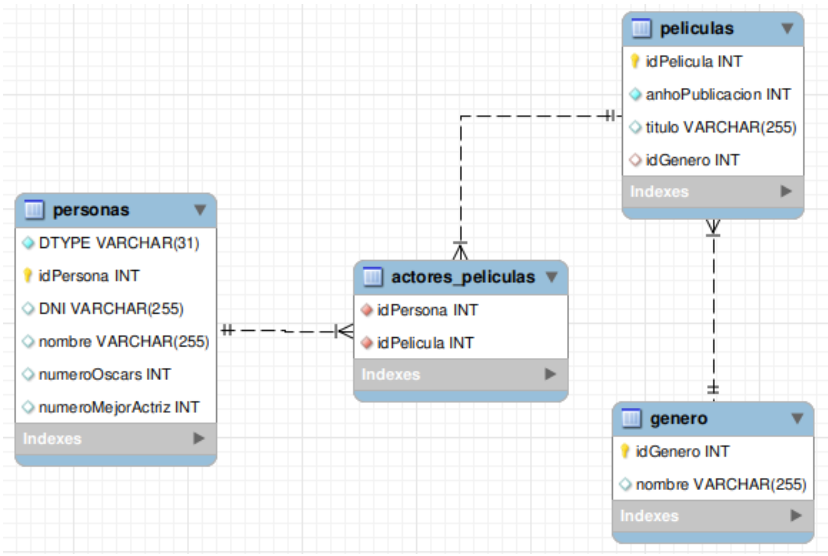

# Ejercicio 308 – Acceso a datos con Hibernate (AD)


**Unidad 3 – Acceso a Datos (AD)**

**Enunciado**   
Ejercicio 308

Se pide crear la estructura de clases en Java necesarias para representar la siguiente base de datos utilizando Hibernate:




Teniendo en cuenta que para la clase `Persona` se utilizará un proceso de herencia de tal forma que se creará dos clases `Actriz` y `Actor`. La clase `Actriz` tendrá el atributo `numeroMejorActriz` y la clase Actor tendrá el atributo `numeroOscars`.

A continuación, se pide:

1. **Crear una clase `GeneroRepositorio` que permita:**
   1. Inserción de nuevo autor
   2. Agregar nuevos géneros
   3. Eliminar registros de un cierto género
   4. Buscando registros por nombre
   5. Buscando registros por identificador
   6. Devolver todos los registros

2. **Implemente la clase `PersonaRepositorio` que podrá:**
   1. Guardar un nuevo objeto de tipo `Persona` la base de datos
   2. Buscar objetos de tipo `Persona` por identificador
   3. Buscar objetos en la `Persona` base de datos de tipos que nacieron después de un año determinado.
   4. Buscar objetos del `Persona`, cuyo valor del campo `numeroMejorActriz` sea mayor a un determinado valor.
   5. Buscar objetos del `Persona`, cuyo valor del campo `numeroOscars` sea mayor a un determinado valor.

3. **Implementar la `PeliculaRepositorio` que será responsable de:**
   1. Agregar `Peliculas`
   2. Eliminar `Peliculas`
   3. Buscar registros por título
   4. Buscando registros por identificador
   5. Devolver todos los registros


---

## Estructura del proyecto

```text
Ejercicio301/
├── .mvn/
├── src/
│   ├── main/
│   │   ├── java/
│   │   │   └── com.AD.U3/
│   │   │       ├── entities/
│   │   │       │   ├── Actor.java
│   │   │       │   └── Actriz.java
│   │   │       │   └── Genero.java
│   │   │       │   └── Pelicula.java
│   │   │       │   └── Persona.java
│   │   │       ├── repository/
│   │   │       │   ├── GeneroRepositorio.java
│   │   │       │   ├── PeliculaRepositorio.java
│   │   │       │   ├── PersonaRepositorio.java
│   │   │       │   ├── Repositorio.java
│   │   │       ├── App.java
│   │   │       └── HibernateUtil.java
│   │   └── resources/
│   │       └── hibernate.cfg.xml
│   └── test/
├── target/
│   ├── classes/
│   └── generated-sources/
├── Ejercicio308.md
└── pom.xml
```
### Solucion

**Entities/Actor.java**
```java 
package com.AD.U3.entities;


import jakarta.persistence.DiscriminatorValue;
import jakarta.persistence.Entity;

@Entity
@DiscriminatorValue("1")
public class Actor extends Persona{

   private int numeroOscars;

   public Actor(String nombre, String dNI, int anhoNacimiento) {
      super(nombre, dNI, anhoNacimiento);
   }

   public Actor(String nombre, String dNI, int numeroOscars, int anhoNacimiento) {
      super(nombre, dNI, anhoNacimiento);
      this.numeroOscars = numeroOscars;
   }

   public int getNumeroOscars() {
      return numeroOscars;
   }

   public void setNumeroOscars(int numeroOscars) {
      this.numeroOscars = numeroOscars;
   }

}


```
**Entities/Actriz.java**
```java 
package com.AD.U3.entities;


import jakarta.persistence.DiscriminatorValue;
import jakarta.persistence.Entity;

@Entity
@DiscriminatorValue("2")
public class Actriz extends Persona{

   private int numeroMejorActriz;

   public Actriz(String nombre, String dNI, int anhoNacimiento) {
      super(nombre, dNI, anhoNacimiento);
   }

   public Actriz(String nombre, String dNI, int numeroMejorActriz, int anhoNacimiento) {
      super(nombre, dNI, anhoNacimiento);
      this.numeroMejorActriz = numeroMejorActriz;
   }

   public int getNumeroMejorActriz() {
      return numeroMejorActriz;
   }

   public void setNumeroMejorActriz(int numeroMejorActriz) {
      this.numeroMejorActriz = numeroMejorActriz;
   }

}


```

**Entities/Genero.java**
```java 
package com.AD.U3.entities;


import jakarta.persistence.*;

import java.util.ArrayList;
import java.util.List;

@Entity
@Table(name = "genero")
public class Genero {

   @Id
   @Column(name = "idGenero")
   @GeneratedValue(strategy = GenerationType.SEQUENCE)
   private int idGenero;
   private String nombre;

   @OneToMany(mappedBy = "genero", cascade = CascadeType.ALL, fetch = FetchType.EAGER)
   private List<Pelicula> listaPeliculas = new ArrayList<Pelicula>();

   public Genero() {
      super();
   }

   public Genero(String nombre) {
      super();
      this.nombre = nombre;
   }

   public int getIdGenero() {
      return idGenero;
   }

   public void setIdGenero(int idGenero) {
      this.idGenero = idGenero;
   }

   public String getNombre() {
      return nombre;
   }

   public void setNombre(String nombre) {
      this.nombre = nombre;
   }

   public void addPelicula(Pelicula pelicula) {
      this.listaPeliculas.add(pelicula);
   }

   @Override
   public String toString() {
      return "Genero [idGenero=" + idGenero + ", nombre=" + nombre + ", listaPeliculas=" + listaPeliculas + "]";
   }

}

```

**Entities/Pelicula.java**
```java 
package com.AD.U3.entities;


import jakarta.persistence.*;

import java.util.ArrayList;
import java.util.List;

@Entity
@Table(name = "peliculas")
public class Pelicula {

   @Id
   @Column(name = "idPelicula")
   @GeneratedValue(strategy = GenerationType.SEQUENCE)
   private int idPelicula;

   private String titulo;
   private int anhoPublicacion;

   @ManyToOne(cascade = CascadeType.ALL, fetch = FetchType.EAGER)
   @JoinColumn(name = "idGenero")
   Genero genero;

   @ManyToMany(mappedBy = "listaPeliculas")
   List<Persona> listaPersonas;

   public Pelicula() {
      super();
   }

   public Pelicula(String titulo, int anhoPublicacion, Genero genero) {
      super();
      this.titulo = titulo;
      this.anhoPublicacion = anhoPublicacion;
      this.genero = genero;
      this.listaPersonas = new ArrayList<Persona>();
      genero.addPelicula(this);
   }

   public int getIdPelicula() {
      return idPelicula;
   }

   public void setIdPelicula(int idPelicula) {
      this.idPelicula = idPelicula;
   }

   public String getTitulo() {
      return titulo;
   }

   public void setTitulo(String titulo) {
      this.titulo = titulo;
   }

   public int getAnhoPublicacion() {
      return anhoPublicacion;
   }

   public void setAnhoPublicacion(int anhoPublicacion) {
      this.anhoPublicacion = anhoPublicacion;
   }

   public Genero getGenero() {
      return genero;
   }

   public void setGenero(Genero genero) {
      this.genero = genero;
   }

   public List<Persona> getListaPersonas() {
      return listaPersonas;
   }

   public void setListaPersonas(List<Persona> listaPersonas) {
      this.listaPersonas = listaPersonas;
   }

   @Override
   public String toString() {
      return "Pelicula [idPelicula=" + idPelicula + ", titulo=" + titulo + ", anhoPublicacion=" + anhoPublicacion
              + "]";
   }
}

```

**Entities/Persona.java**
```java 
package com.AD.U3.entities;


import jakarta.persistence.*;

import java.util.ArrayList;
import java.util.List;


@Entity(name = "personas")
@Inheritance(strategy = InheritanceType.SINGLE_TABLE)
@DiscriminatorColumn(name="tipo_persona", discriminatorType = DiscriminatorType.INTEGER)
public class Persona {

   @Id
   @GeneratedValue(strategy = GenerationType.SEQUENCE)
   @Column(name = "idPersona")
   private int idPersona;
   private String nombre;
   private int anhoNacimiento;
   private String DNI;

   @ManyToMany
   @JoinTable(name="actores_peliculas",
           joinColumns = @JoinColumn(name="idPersona"),
           inverseJoinColumns = @JoinColumn(name="idPelicula"))
   List<Pelicula> listaPeliculas = new ArrayList<Pelicula>();

   public Persona() {
      super();
   }

   public Persona(String nombre, String dNI, int anhoNacimiento) {
      super();
      this.nombre = nombre;
      this.DNI = dNI;
      this.anhoNacimiento = anhoNacimiento;
   }

   public String getNombre() {
      return nombre;
   }

   public void setNombre(String nombre) {
      this.nombre = nombre;
   }

   public String getDNI() {
      return DNI;
   }

   public void setDNI(String dNI) {
      DNI = dNI;
   }

   public int getIdPersona() {
      return idPersona;
   }

   public void setIdPersona(int idPersona) {
      this.idPersona = idPersona;
   }

   public List<Pelicula> getListaPeliculas() {
      return listaPeliculas;
   }

   public void setListaPeliculas(List<Pelicula> listaPeliculas) {
      this.listaPeliculas = listaPeliculas;
   }

   public int getAnhoNacimiento() {
      return anhoNacimiento;
   }

   public void setAnhoNacimiento(int anhoNacimiento) {
      this.anhoNacimiento = anhoNacimiento;
   }

   @Override
   public String toString() {
      return "Persona [idPersona=" + idPersona + ", nombre=" + nombre + ", anhoNacimiento=" + anhoNacimiento
              + ", DNI=" + DNI + "]";
   }
}


```

**Repository/GeneroRepositorio.java**
```java 
package com.AD.U3.repository;


import com.AD.U3.entities.Genero;
import jakarta.persistence.Query;
import org.hibernate.Session;
import org.hibernate.Transaction;

import java.util.ArrayList;
import java.util.List;


public class GeneroRepositorio implements Repositorio<Genero>{

   private Session sesion;

   public GeneroRepositorio(Session session) {
      this.sesion = session;
   }

   @Override
   public void guardar(Genero t) {
      this.sesion.persist(t);
   }

   @Override
   public void eliminar(Genero t) {
      this.sesion.remove(t);
   }

   @Override
   public Genero buscarPorId(int id) {
      Transaction trx = this.sesion.beginTransaction();
      Query query = this.sesion.createQuery("select g from Genero g where g.idGenero=:idGenero");
      query.setParameter("idGenero", id);

      Genero genero = (Genero) query.getSingleResult();
      trx.commit();

      return genero;
   }

   @Override
   public List<Genero> buscarPorCadena(String cadena) {
      Transaction trx = this.sesion.beginTransaction();
      Query query = this.sesion.createQuery("select g from Genero g where g.nombre=:cadena");
      query.setParameter("cadena", cadena);

      ArrayList<Genero> listaGenero = (ArrayList<Genero>) query.getResultList();
      trx.commit();
      return listaGenero;
   }

   @Override
   public void actualizar(Genero t) {
      this.sesion.update(t);
   }

   public List<Genero> buscarTodo() {
      Transaction trx = this.sesion.beginTransaction();
      Query query = this.sesion.createQuery("select g from Genero g");

      ArrayList<Genero> listaGenero = (ArrayList<Genero>) query.getResultList();
      trx.commit();
      return listaGenero;
   }
}


```
**Repository/PeliculaRepositorio.java**
```java 
package com.AD.U3.repository;


import com.AD.U3.entities.Pelicula;
import com.AD.U3.entities.Persona;
import jakarta.persistence.Query;
import org.hibernate.Session;
import org.hibernate.Transaction;

import java.util.ArrayList;
import java.util.List;


public class PeliculaRepositorio implements Repositorio<Pelicula>{

   private Session sesion;

   public PeliculaRepositorio(Session sesion) {
      this.sesion = sesion;
   }

   @Override
   public void guardar(Pelicula t) {
      this.sesion.persist(t);
   }

   @Override
   public void eliminar(Pelicula t) {
      this.sesion.remove(t);
   }

   @Override
   public Pelicula buscarPorId(int id) {
      Transaction trx = this.sesion.beginTransaction();
      Query query = this.sesion.createQuery("select p from Pelicula p where p.idPelicula=:idPelicula");
      query.setParameter("idPelicula", id);

      Pelicula pelicula = (Pelicula) query.getSingleResult();
      trx.commit();

      return pelicula;
   }

   @Override
   public List<Pelicula> buscarPorCadena(String cadena) {
      Transaction trx = this.sesion.beginTransaction();
      Query query = this.sesion.createQuery("select p from Pelicula p where p.titulo = :cadena");
      query.setParameter("cadena", cadena);

      ArrayList<Pelicula> listaPelicula = (ArrayList<Pelicula>) query.getResultList();
      trx.commit();
      return listaPelicula;
   }

   @Override
   public void actualizar(Pelicula t) {
      this.sesion.update(t);
   }

   public List<Pelicula> buscarTodo() {
      Transaction trx = this.sesion.beginTransaction();
      Query query = this.sesion.createQuery("select p from Pelicula p");

      ArrayList<Pelicula> listaPelicula = (ArrayList<Pelicula>) query.getResultList();
      trx.commit();
      return listaPelicula;
   }

   public List<Pelicula> peliculasPorPersona(Persona p) {
      Transaction trx = this.sesion.beginTransaction();
      Query query = this.sesion.createQuery("select pel from Pelicula pel, Persona p, listaPeliculas lp "
              + "where pel.idPelicula=lp.idPelicula and lp.idPersona=:idPersona");
      query.setParameter("idPersona", p.getIdPersona());
      ArrayList<Pelicula> listaPelicula = (ArrayList<Pelicula>) query.getResultList();
      trx.commit();
      return listaPelicula;
   }
}


```
**Repository/PersonaRepositorio.java**
```java 
package com.AD.U3.repository;


import com.AD.U3.entities.Persona;
import jakarta.persistence.Query;
import org.hibernate.Session;
import org.hibernate.Transaction;

import java.util.ArrayList;
import java.util.List;


public class PersonaRepositorio implements Repositorio<Persona>{

   private Session sesion;

   public PersonaRepositorio(Session sesion) {
      this.sesion = sesion;
   }

   @Override
   public void guardar(Persona t) {
      Transaction trxTransaction = sesion.beginTransaction();
      this.sesion.persist(t);
      trxTransaction.commit();
   }

   @Override
   public void eliminar(Persona t) {
      this.sesion.remove(t);
   }

   @Override
   public Persona buscarPorId(int id) {
      Transaction trx = this.sesion.beginTransaction();
      Query query = null;
      Persona persona = null;
      try {
         query = this.sesion.createQuery("select p from Actriz p where p.idPersona=:idPersona");
         query.setParameter("idPersona", id);
         persona = (Persona) query.getSingleResult();
      }catch (Exception e) {
         try {
            query = this.sesion.createQuery("select p from Actor p where p.idPersona=:idPersona");
            query.setParameter("idPersona", id);
            persona = (Persona) query.getSingleResult();
         }catch (Exception e1) {
            System.out.println("Error recuperando valores actor");
         }

      }
      trx.commit();

      return persona;
   }

   @Override
   public List<Persona> buscarPorCadena(String cadena) {
      Transaction trx = this.sesion.beginTransaction();
      ArrayList<Persona> listaPersona = null;
      Query query = null;
      try {
         query = this.sesion.createQuery("select p from Persona p where p.anhoNacimiento > :cadena");
         query.setParameter("cadena", cadena);
         listaPersona = (ArrayList<Persona>) query.getResultList();
      }catch (Exception e) {
         try {
            query = this.sesion.createQuery("select p from Actor p where p.anhoNacimiento > :cadena");
            query.setParameter("cadena", cadena);
            listaPersona = (ArrayList<Persona>) query.getResultList();
         }catch (Exception e1) {
            System.out.println("Error recuperando valores actor");
         }

      }

      trx.commit();
      return listaPersona;
   }

   public List<Persona> buscarPorAnho(int cadena) {
      Transaction trx = this.sesion.beginTransaction();
      ArrayList<Persona> listaPersona = null;
      Query query = null;
      try {
         query = this.sesion.createQuery("select p from Actriz p where p.anhoNacimiento > :cadena");
         query.setParameter("cadena", cadena);
         listaPersona = (ArrayList<Persona>) query.getResultList();
      }catch (Exception e) {
         try {
            query = this.sesion.createQuery("select p from Actor p where p.anhoNacimiento > :cadena");
            query.setParameter("cadena", cadena);
            listaPersona = (ArrayList<Persona>) query.getResultList();
         }catch (Exception e1) {
            System.out.println("Error recuperando valores actor");
         }

      }

      trx.commit();
      return listaPersona;
   }

   @Override
   public void actualizar(Persona t) {
      this.sesion.update(t);
   }

   public List<Persona> buscarPorMejorActriz(int mejorActriz) {
      Transaction trx = this.sesion.beginTransaction();
      Query query = this.sesion.createQuery("select p from Actriz p where p.numeroMejorActriz >= :mejorActriz");
      query.setParameter("mejorActriz", mejorActriz);

      ArrayList<Persona> listaPersona = (ArrayList<Persona>) query.getResultList();
      trx.commit();
      return listaPersona;
   }

   public List<Persona> buscarPorMejorActor(int mejorActor) {
      Transaction trx = this.sesion.beginTransaction();
      Query query = this.sesion.createQuery("select p from Actor p where p.numeroOscars >= :numeroOscars");
      query.setParameter("numeroOscars", mejorActor);

      ArrayList<Persona> listaPersona = (ArrayList<Persona>) query.getResultList();
      trx.commit();
      return listaPersona;
   }
}


```
**Repository/Repositorio.java**
```java 
package com.AD.U3.repository;


import java.util.List;

public interface Repositorio<T> {

   public void guardar(T t);
   public void eliminar(T t);
   public T buscarPorId(int id);
   public List<T> buscarPorCadena(String cadena);
   public void actualizar(T t);

}


```


**App.java**
```java 
package com.AD.U3;
/*
Ejercicio 308
Se pide crear la estructura de clases en Java necesarias para representar la siguiente base de datos utilizando Hibernate:


Teniendo en cuenta que para la clase Persona se utilizará un proceso de herencia de tal forma que se creará dos clases Actriz y Actor. La clase Actriz tendrá el atributo numeroMejorActriz y la clase Actor tendrá el atributo numeroOscars.

A continuación, se pide:

Crear una clase GeneroRepositorio que permita:

Agregar nuevos géneros
Eliminar registros de un cierto género
Buscando registros por nombre
Buscando registros por identificador
Devolver todos los registros
Implemente la clase PersonaRepositorio que podrá:

Guardar un nuevo objeto de tipo Persona la base de datos
Buscar objetos de tipo Persona por identificador
Buscar objetos en la Persona base de datos de tipos que nacieron después de un año determinado.
Buscar objetos del Persona, cuyo valor del campo numeroMejorActriz sea mayor a un determinado valor.
Buscar objetos del Persona, cuyo valor del campo numeroOscars sea mayor a un determinado valor.
Implementar la PeliculaRepositorio que será responsable de:

Agregar Peliculas
Eliminar Peliculas
Buscar registros por título
Buscando registros por identificador
Devolver todos los registros
 */
import com.AD.U3.entities.*;
import com.AD.U3.repository.GeneroRepositorio;
import com.AD.U3.repository.PeliculaRepositorio;
import com.AD.U3.repository.PersonaRepositorio;
import org.hibernate.Session;

import java.util.ArrayList;
import java.util.List;
import java.util.Scanner;

/**
 * Hello world!
 *
 */
public class App {
   static Scanner scanner ;

   public static void main(String[] args) {
      System.out.println("Ejercicio 308");

      Session session = HibernateUtil.get().openSession();
      GeneroRepositorio generoRepositorio = new GeneroRepositorio(session);
      PeliculaRepositorio peliculaRepositorio = new PeliculaRepositorio(session);
      PersonaRepositorio personaRepositorio = new PersonaRepositorio(session);


      scanner = new Scanner(System.in);

      int opcion = -1;

      do {
         opcion = pedirInt("1. Agregar nuevos géneros\n" +
                 "2. Eliminar registros de un cierto género\n" +
                 "3. Buscando género por identificador\n" +
                 "4. Buscando género  por nombre\n" +
                 "5. Devolver todos los registros de la tabla género\n" +
                 "6. Guardar nueva persona\n" +
                 "7. Buscar persona por id\n" +
                 "8. Buscar persona según fecha de nacimiento\n" +
                 "9. Buscar persona por veces que ganó el premio mejor actriz.\n" +
                 "10. Buscar persona por veces que ganó el oscar.\n" +
                 "11. Agregar nueva pelicula \n" +
                 "12. Eliminar pelicula.\n" +
                 "13. Buscar película por título\n" +
                 "14. Buscando película por identificador\n" +
                 "15. Devolver todos las películas\n" +
                 "16. Recuperar todas las películas en las que participó cierta persona.\n"
                 + "17. Salir");

         switch (opcion) {
            case 1: {
               String nombreGenero = pedirString("Nombre del nuevo genero");
               generoRepositorio.guardar(new Genero(nombreGenero));
               break;
            }
            case 2: {
               int idGenero = pedirInt("Id del genero a eliminar");
               try {
                  Genero genero = generoRepositorio.buscarPorId(idGenero);
                  generoRepositorio.eliminar(genero);
               }catch (Exception e) {
                  System.out.println("Error al eliminar un género");
               }
               break;
            }
            case 3: {
               int idGenero = pedirInt("Id del genero a buscar");
               Genero genero = generoRepositorio.buscarPorId(idGenero);
               System.out.println(genero.toString());
               break;
            }
            case 4: {
               String cadena = pedirString("Nombre del genero a buscar");
               List<Genero> listaGenero = generoRepositorio.buscarPorCadena(cadena);
               for (Genero genero: listaGenero)
                  System.out.println(genero.toString());
               break;
            }
            case 5: {
               ArrayList<Genero> listaGeneros = (ArrayList<Genero>) generoRepositorio.buscarTodo();
               for(Genero genero: listaGeneros)
                  System.out.println(genero.toString());
               break;
            }
            case 6: {
               String actizActor = "";
               do{
                  actizActor = pedirString("Es actriz o actor?").trim();
               }while(!actizActor.equals("actor") && !actizActor.equals("actriz") );

               int anhoNacimiento = pedirInt("Año de nacimiento");
               if (actizActor.equals("actor")) {
                  String nombre = pedirString("Nombre del actor");
                  String dni = pedirString("DNI del actor");
                  int numeroOscars = pedirInt("Número de oscars");
                  Persona actor = new Actor(nombre, dni, numeroOscars, anhoNacimiento);
                  personaRepositorio.guardar(actor);
               }else if(actizActor.equals("actriz")) {
                  String nombre = pedirString("Nombre de la actriz");
                  String dni = pedirString("DNI de la actriz");
                  int numeroMejorActriz = pedirInt("Número de veces ganó el premio mejor actriz");
                  Persona actriz = new Actriz(nombre, dni, numeroMejorActriz, anhoNacimiento);
                  personaRepositorio.guardar(actriz);
               }

               break;
            }
            case 7: {
               int id = pedirInt("Introduzca el ID ");
               Persona persona = personaRepositorio.buscarPorId(id);
               System.out.println(persona.toString());
               break;
            }
            case 8: {
               int anho = pedirInt("Introduzca el año a partir del cual quieres buscar");
               List<Persona> listaPersonas = personaRepositorio.buscarPorAnho(anho);
               for (Persona persona: listaPersonas)
                  System.out.println(persona.toString());
               break;
            }
            case 9: {
               int vecesGano = pedirInt("Introduzca el número de veces que alguien ganó el premio a la mejor actriz.");
               ArrayList<Persona> listaPersonas = (ArrayList<Persona>) personaRepositorio.buscarPorMejorActriz(vecesGano);
               for(Persona persona: listaPersonas)
                  System.out.println(persona.toString());
               break;
            }
            case 10: {
               int vecesGano = pedirInt("Introduzca el número de veces que alguien ganó el premio a la mejor actriz.");
               ArrayList<Persona> listaPersonas = (ArrayList<Persona>) personaRepositorio.buscarPorMejorActor(vecesGano);
               for(Persona persona: listaPersonas)
                  System.out.println(persona.toString());
               break;
            }
            case 11: {
               String titulo = pedirString("Introduzca el nombre de la película");
               int anho = pedirInt("Introduzca el año de la película");
               int idGenero = pedirInt("Introduzca el ID del género de la película");
               try {
                  Genero genero = generoRepositorio.buscarPorId(idGenero);
                  Pelicula pelicula = new Pelicula(titulo, anho, genero);
                  peliculaRepositorio.guardar(pelicula);
               } catch (Exception e) {
                  System.out.println("ID del género no es válido");
               }
               break;
            }
            case 12: {
               int idPelicula = pedirInt("Introduzca el ID de la película a eliminar");
               try {
                  Pelicula pelicula = peliculaRepositorio.buscarPorId(idPelicula);
                  peliculaRepositorio.eliminar(pelicula);
               }catch (Exception e) {
                  System.out.println("No exista ese ID para la película");
               }
               break;
            }
            case 13: {
               String titulo = pedirString("Introduzca el titulo de la película");
               try {
                  List<Pelicula> listaPeliculas = peliculaRepositorio.buscarPorCadena(titulo);
                  for(Pelicula pelicula: listaPeliculas)
                     System.out.println(pelicula.toString());
               }catch (Exception e) {
                  System.out.println("No existe una película con ese título");
               }
               break;
            }
            case 14: {
               int id = pedirInt("Introduzca el id de la película");
               try {
                  Pelicula pelicula = (Pelicula) peliculaRepositorio.buscarPorId(id);
                  System.out.println(pelicula.toString());
               }catch (Exception e) {
                  System.out.println("No existe una película con ese ID");
               }
               break;
            }
            case 15: {
               ArrayList<Pelicula> listaPeliculas = (ArrayList<Pelicula>) peliculaRepositorio.buscarTodo();
               for (Pelicula pelicula: listaPeliculas)
                  System.out.println(pelicula.toString());
               break;
            }
            case 17: {
               System.exit(0);
            }
         }

      }while(opcion != 17);

      session.close();
      System.out.println("Finalizando la conexion a MySQL");
   }


   public static int pedirInt(String string) {
      System.out.println(string);
      return scanner.nextInt();
   }

   public static Double pedirDouble(String string) {
      System.out.println(string);
      return scanner.nextDouble();
   }

   public static String pedirString(String string) {
      System.out.println(string);
      return scanner.next();
   }

}

```
**HibernateUtil.java**
```java
package com.AD.U3;

import org.hibernate.SessionFactory;
import org.hibernate.cfg.Configuration;

import java.io.File;

public class HibernateUtil {

    private static final SessionFactory SESSION_FACTORY;

    static {
        try {
//            String hibernatePropsFilePath = "./src/hibernate.cfg.xml"; // Ruta al fichero
//
//            File hibernatePropsFile = new File(hibernatePropsFilePath);
//
//            SESSION_FACTORY = new Configuration().configure(hibernatePropsFile).buildSessionFactory();
// Hibernate buscará hibernate.cfg.xml en el classpath (src/main/resources)
            SESSION_FACTORY = new Configuration()
                    .configure()    // sin argumentos
                    .buildSessionFactory();
        }catch(Throwable ex) {
            System.err.println("Error al crear la configuración de hibernate" + ex.getMessage());
            throw new ExceptionInInitializerError();
        }
    }

    public static SessionFactory get() {
        return SESSION_FACTORY;
    }
}
```

**hibernate.cfg.xml**
```xml 
<?xml version="1.0" encoding="UTF-8"?>
<!DOCTYPE hibernate-configuration PUBLIC "-//Hibernate/Hibernate Configuration DTD 3.0//EN" "http://www.hibernate.org/dtd/hibernate-configuration-3.0.dtd">
<hibernate-configuration>
   <session-factory>
      <property name="connection.driver_class">com.mysql.jdbc.Driver</property>
      <property name="connection.url">jdbc:mysql://localhost:3306/actores?serverTimezone=UTC</property>
      <property name="connection.username">root</property>
      <property name="connection.password">abc123.</property>
      <property name="hbm2ddl.auto">create</property>
      <property name="dialect">org.hibernate.dialect.MySQL8Dialect</property>
      <property name="hibernate.dialect.storage_engine">innodb</property>
      <property name="hibernate.show_sql">true</property>

      <!--Mapping de las clases-->
      <mapping class="com.AD.U3.entities.Persona"/>
      <mapping class="com.AD.U3.entities.Actor"/>
      <mapping class="com.AD.U3.entities.Actriz"/>
      <mapping class="com.AD.U3.entities.Genero"/>
      <mapping class="com.AD.U3.entities.Pelicula"/>

   </session-factory>
</hibernate-configuration>
```
